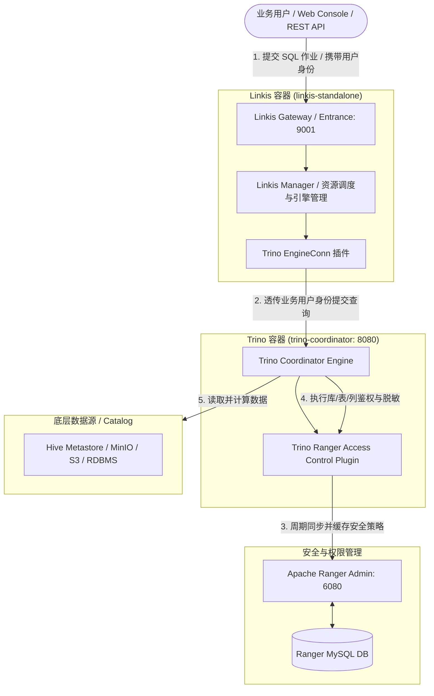
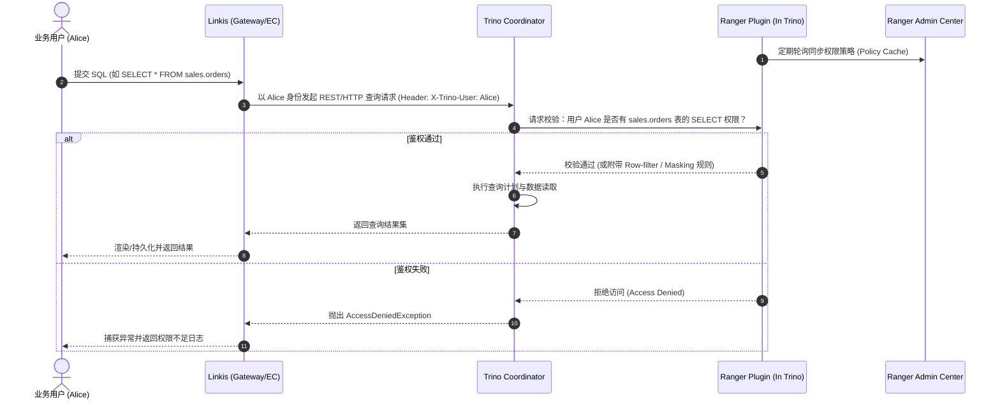

# WSL Docker 环境下 Apache Linkis、Trino 与 Apache Ranger 集成部署方案

## 1. 概述与设计目标

本文档针对在 Windows WSL2 (Ubuntu / Debian) 的 Docker 环境中，完整构建 **Apache Linkis** 计算治理平台，并实现与 **Trino** 分布式 SQL 查询引擎及 **Apache Ranger** 统一权限管理中心的安全与任务调度对接。

### 核心目标
1. **统一计算治理**：通过 Linkis 统一接收、调度与管理上层业务（或 BI/AI 工具）发起的 SQL 查询作业。
2. **多租户身份透传（User Impersonation）**：Linkis 保持提交用户的真实身份（Submit User），透传给 Trino，杜绝超级用户代查导致的安全审计漏洞。
3. **细粒度权限管控与数据安全**：在 Trino 服务端集成 Apache Ranger 插件，集中管理基于 RBAC 的库/表/列访问控制、行级过滤（Row-level Filtering）及动态列脱敏（Data Masking）。
4. **轻量化容器化部署**：全套组件基于 Docker Compose 部署于 WSL2 内部，网络相互隔离且易于一键拉起与重置。

---

## 2. 整体架构与流程设计

### 2.1 架构拓扑图 (直观字符图)

```text
+------------------------------------------------------------------------------------+
|                         业务用户 / Web Console / REST API                           |
+------------------------------------------------------------------------------------+
                                      | 1. 提交 SQL / 携带用户身份 (如 Alice)
                                      v
+------------------------------------------------------------------------------------+
|                      Linkis 容器 (linkis-standalone : 9001)                        |
|                                                                                    |
|   +-----------------------+              +-------------------------------------+   |
|   |   Linkis Gateway      | -----------> |   Linkis Manager (资源调度/治理)     |   |
|   +-----------------------+              +-------------------------------------+   |
|                                                             |                      |
|                                                             v                      |
|                                          +-------------------------------------+   |
|                                          |      Trino EngineConn 引擎插件      |   |
|                                          +-------------------------------------+   |
+------------------------------------------------------------------------------------+
                                      |
                                      | 2. 透传用户身份发起查询 (X-Trino-User: Alice)
                                      v
+--------------------------------------------------+    +----------------------------+
|        Trino 容器 (trino-coordinator : 8080)     |    |   Ranger 安全与权限管控     |
|                                                  |    |                            |
|   +------------------------------------------+   |    |  +----------------------+  |
|   |         Trino Coordinator Engine         |   |    |  |  Ranger Admin :6080  |  |
|   +------------------------------------------+   |    |  +----------------------+  |
|                        |                         |    |             ^              |
|                        | 4. 库/表/列鉴权 & 脱敏   |    |             | 3. 定期轮询  |
|                        v                         |    |             |    同步策略  |
|   +------------------------------------------+   |    |             v              |
|   |   Trino Ranger Access Control 插件 (本地)| <-+----+-> +----------------------+  |
|   +------------------------------------------+   | 缓存 |   Ranger MySQL DB    |  |
+--------------------------------------------------+ 策略 +----------------------+  |
                         |                                                           |
                         | 5. 鉴权通过后读取数据                                      |
                         v                                                           |
+--------------------------------------------------+                                 |
|       底层存储与 Catalog (Hive / MinIO / MySQL)   |<--------------------------------+
+--------------------------------------------------+
```

<details>
<summary><b>点击展开 Mermaid 架构图源码</b></summary>



</details>

---

### 2.2 任务执行与鉴权时序 (直观字符图)

```text
[用户 Alice]           [Linkis]              [Trino Coordinator]     [Ranger 插件]         [Ranger Admin]
    |                     |                          |                    |                     |
    |                     |                          |                    |-- 1. 同步权限策略 ->|
    |                     |                          |                    |<- 策略缓存至本地 ---|
    |                     |                          |                    |                     |
    |-- 2. 提交查询 SQL ->|                          |                    |                     |
    |   (SELECT * FROM)   |                          |                    |                     |
    |                     |-- 3. HTTP透传Alice身份 ->|                    |                     |
    |                     |   (Header: User: Alice)  |                    |                     |
    |                     |                          |-- 4. 权限校验 ---->|                     |
    |                     |                          |   (Alice是否有权限)|                     |
    |                     |                          |                    |                     |
    |                     |                          |<- 5. 校验结果 -----|                     |
    |                     |                          |   [允许/附带脱敏]   |                     |
    |                     |                          |                    |                     |
    |                     |                          |-- 6. 执行查询并读取底层数据              |
    |                     |<- 7. 返回结果集 ---------|                                          |
    |<- 8. 呈现查询结果 --|                                                                     |
```

<details>
<summary><b>点击展开 Mermaid 时序图源码</b></summary>



</details>

---

## 3. 环境规划与容器组件清单

### 3.1 WSL2 资源配置建议
建议在 Windows 用户目录的 `%USERPROFILE%\.wslconfig` 中配置资源限制，避免高负载下内存溢出：
```ini
[wsl2]
memory=12GB
processors=4
swap=4GB
```

### 3.2 容器服务规划表

| 容器服务名 (`service`) | 基础镜像 | 默认端口 | 职责说明 |
| :--- | :--- | :--- | :--- |
| **`linkis-mysql`** | `mysql:8.0` | `3306` | 存储 Linkis 元数据 (`linkis`) 与 Ranger 元数据 (`ranger`) |
| **`ranger-admin`** | `apache/ranger:2.4.0` | `6080` | Ranger 策略管理控制台与策略分发服务 |
| **`trino-coordinator`** | `trinodb/trino:410+` | `8080` | Trino 引擎服务，内嵌 Ranger Trino Access Control 插件 |
| **`linkis-standalone`** | `apache/linkis:1.8.0` | `9001` | Linkis 一体化镜像（Gateway、Manager、EnginePlugin、Entrance） |

---

## 4. Docker Compose 编排模版

在 WSL2 宿主机创建部署目录结构：
```bash
mkdir -p ~/linkis-env/{mysql,ranger,trino/etc,trino/plugin,linkis}/conf
```

### `docker-compose.yml` 示例配置

```yaml
version: '3.8'

networks:
  linkis-net:
    driver: bridge

services:
  # 1. 基础数据库
  linkis-mysql:
    image: mysql:8.0
    container_name: linkis-mysql
    restart: always
    environment:
      MYSQL_ROOT_PASSWORD: root
    ports:
      - "3306:3306"
    volumes:
      - ./mysql/data:/var/lib/mysql
      - ./mysql/init:/docker-entrypoint-initdb.d
    networks:
      - linkis-net
    command: --character-set-server=utf8mb4 --collation-server=utf8mb4_unicode_ci

  # 2. Apache Ranger Admin
  ranger-admin:
    image: apache/ranger:2.4.0
    container_name: ranger-admin
    depends_on:
      - linkis-mysql
    environment:
      - DB_FLAVOR=MYSQL
      - SQL_CONNECTOR_JAR=/usr/share/java/mysql-connector-java.jar
      - db_host=linkis-mysql:3306
      - db_root_password=root
      - db_name=ranger
      - db_user=rangeradmin
      - db_password=rangeradmin
      - rangerAdmin_password=RangerAdmin123!
    ports:
      - "6080:6080"
    networks:
      - linkis-net

  # 3. Trino Coordinator (挂载 Ranger Plugin)
  trino-coordinator:
    image: trinodb/trino:414
    container_name: trino-coordinator
    depends_on:
      - ranger-admin
    ports:
      - "8080:8080"
    volumes:
      - ./trino/etc:/etc/trino
      - ./trino/plugin/ranger:/usr/lib/trino/plugin/ranger
      - ./trino/ranger-cache:/etc/trino/ranger-cache
    networks:
      - linkis-net

  # 4. Linkis Standalone
  linkis-standalone:
    image: apache/linkis:1.8.0
    container_name: linkis-standalone
    depends_on:
      - linkis-mysql
      - trino-coordinator
    environment:
      - MYSQL_HOST=linkis-mysql
      - MYSQL_PORT=3306
      - MYSQL_DB=linkis
      - MYSQL_USER=root
      - MYSQL_PASSWORD=root
    ports:
      - "9001:9001"
      - "20000-20010:20000-20010"
    volumes:
      - ./linkis/conf:/opt/linkis/conf
      - ./linkis/engineplugins:/opt/linkis/lib/linkis-engineplugins
      - ./linkis/logs:/opt/linkis/logs
    networks:
      - linkis-net
```

---

## 5. 对接与配置实施步骤

### 5.1 Ranger 与 Trino 对接配置

1. **在 Ranger Admin 中定义 Trino 策略服务**：
   - 登录 Ranger Admin Web 控制台（`http://localhost:6080`，默认用户名/密码：`admin / RangerAdmin123!`）。
   - 在 **TRINO** 组件下新建一个 Service，例如命名为 `trino_dev`。
   - 配置连接信息并保存。

2. **配置 Trino 访问控制（`access-control.properties`）**：
   在 Trino 的挂载目录 `trino/etc/access-control.properties` 中添加：
   ```properties
   access-control.name=ranger
   ranger.service-name=trino_dev
   ranger.ranger-url=http://ranger-admin:6080
   ranger.cache-dir=/etc/trino/ranger-cache
   ranger.policy-poll-interval-ms=30000
   ```

---

### 5.2 Linkis 与 Trino 引擎对接配置

1. **编译并部署 Trino EngineConn 插件**：
   在 Linkis 源码目录下执行编译：
   ```bash
   cd linkis-engineconn-plugins/trino
   mvn clean install -DskipTests
   ```
   将生成的插件包（位于 `target/out/trino`）拷贝到 Linkis 容器挂载的引擎目录：
   ```bash
   cp -r target/out/trino ~/linkis-env/linkis/engineplugins/
   ```

2. **执行元数据初始化 SQL**：
   在 `linkis-mysql` 的 `linkis` 库中执行 Trino 引擎的元数据注册与配置 SQL（对应标签 `trino-371` 或自定义 Trino 版本）：
   ```sql
   -- 1. 注册引擎标签
   SET @ENGINE_LABEL="trino-371";
   SET @ENGINE_IDE=CONCAT('*-IDE,',@ENGINE_LABEL);
   SET @ENGINE_ALL=CONCAT('*-*,',@ENGINE_LABEL);
   SET @ENGINE_NAME="trino";

   insert into `linkis_cg_manager_label` (`label_key`, `label_value`, `label_feature`, `label_value_size`, `update_time`, `create_time`) VALUES ('combined_userCreator_engineType', @ENGINE_ALL, 'OPTIONAL', 2, now(), now());
   insert into `linkis_cg_manager_label` (`label_key`, `label_value`, `label_feature`, `label_value_size`, `update_time`, `create_time`) VALUES ('combined_userCreator_engineType', @ENGINE_IDE, 'OPTIONAL', 2, now(), now());
   select @label_id := id from `linkis_cg_manager_label` where label_value = @ENGINE_IDE;
   insert into `linkis_ps_configuration_category` (`label_id`, `level`) VALUES (@label_id, 2);

   -- 2. 插入 Trino 配置 Key
   INSERT INTO `linkis_ps_configuration_config_key` (`key`, `description`, `name`, `default_value`, `validate_type`, `validate_range`, `engine_conn_type`, `is_hidden`, `is_advanced`, `level`, `treeName`) VALUES ('linkis.trino.url', 'Trino服务器URL', 'Trino服务器URL', 'http://trino-coordinator:8080', 'None', '', @ENGINE_NAME, 0, 0, 1, '数据源配置');
   INSERT INTO `linkis_ps_configuration_config_key` (`key`, `description`, `name`, `default_value`, `validate_type`, `validate_range`, `engine_conn_type`, `is_hidden`, `is_advanced`, `level`, `treeName`) VALUES ('linkis.trino.catalog', '连接Trino查询时使用的catalog', 'Catalog', 'system', 'None', '', @ENGINE_NAME, 0, 0, 1, '数据源配置');
   INSERT INTO `linkis_ps_configuration_config_key` (`key`, `description`, `name`, `default_value`, `validate_type`, `validate_range`, `engine_conn_type`, `is_hidden`, `is_advanced`, `level`, `treeName`) VALUES ('linkis.trino.default.limit', '查询结果集条数限制', '结果集条数限制', '5000', 'None', '', @ENGINE_NAME, 0, 0, 1, '数据源配置');
   INSERT INTO `linkis_ps_configuration_config_key` (`key`, `description`, `name`, `default_value`, `validate_type`, `validate_range`, `engine_conn_type`, `is_hidden`, `is_advanced`, `level`, `treeName`) VALUES ('linkis.trino.http.connectTimeout', '连接Trino超时时间', '连接超时时间（秒）', '60', 'None', '', @ENGINE_NAME, 0, 0, 1, '数据源配置');

   -- 3. 关联关系与默认配置
   insert into `linkis_ps_configuration_key_engine_relation` (`config_key_id`, `engine_type_label_id`)
   (select config.id as config_key_id, label.id AS engine_type_label_id FROM `linkis_ps_configuration_config_key` config
   INNER JOIN `linkis_cg_manager_label` label ON config.engine_conn_type = @ENGINE_NAME and label_value = @ENGINE_ALL);

   insert into `linkis_ps_configuration_config_value` (`config_key_id`, `config_value`, `config_label_id`)
   (select relation.config_key_id AS config_key_id, '' AS config_value, relation.engine_type_label_id AS config_label_id FROM `linkis_ps_configuration_key_engine_relation` relation
   INNER JOIN `linkis_cg_manager_label` label ON relation.engine_type_label_id = label.id AND label.label_value = @ENGINE_ALL);
   ```

3. **刷新/重启 EnginePlugin 模块**：
   在 Linkis 容器内或通过 REST 接口刷新引擎物料缓存：
   ```bash
   docker exec -it linkis-standalone sh -c "cd /opt/linkis/sbin && sh linkis-daemon.sh restart cg-engineplugin"
   ```

---

## 6. 联调验证与测试方案

### 6.1 基础连通性测试
使用 Linkis CLI 提交测试查询验证链路：
```bash
docker exec -it linkis-standalone sh -c "
/opt/linkis/bin/linkis-cli -submitUser hadoop \
  -engineType trino-371 \
  -code 'SHOW CATALOGS;' \
  -runtimeMap linkis.trino.url=http://trino-coordinator:8080
"
```

### 6.2 权限管控与阻断验证 (Ranger 策略测试)

| 场景编号 | 测试用例描述 | Ranger 策略配置 | 提交方式与用户 | 预期结果 |
| :--- | :--- | :--- | :--- | :--- |
| **TC-01** | 正向授权查询 | 允许用户 `alice` 访问 `tpch.tiny.*` 表 | `linkis-cli -submitUser alice -code 'SELECT * FROM tpch.tiny.nation LIMIT 3;'` | **成功**返回 3 条数据 |
| **TC-02** | 越权访问拦截 | 拒绝用户 `bob` 访问 `tpch.tiny.*` 表 | `linkis-cli -submitUser bob -code 'SELECT * FROM tpch.tiny.nation LIMIT 3;'` | **被拒绝**，日志抛出 `Access Denied` |
| **TC-03** | 动态列脱敏 | 对用户 `alice` 针对 `tpch.customer.phone` 启用 Partial Mask | `linkis-cli -submitUser alice -code 'SELECT name, phone FROM tpch.sf1.customer LIMIT 3;'` | **成功**，`phone` 字段显示掩码（如 `155-XXXX-7890`） |

---

## 7. 常见问题排查与避坑指南

1. **WSL2 与 Docker 容器网络通讯问题**：
   - 必须使用统一自定义 Docker Network（如 `linkis-net`），服务地址使用**容器名**（如 `http://trino-coordinator:8080`），切勿直接使用 `127.0.0.1` 或 `localhost`。
2. **Ranger 策略生效延迟**：
   - Trino Ranger 插件采用拉取并本地缓存机制，策略更新通常有 `policy-poll-interval-ms` 延迟（默认 30s）。调试时可将轮询间隔缩短到 5s。
3. **用户认证与多租户映射**：
   - 确保 Linkis 传入的 `submitUser` 与 Ranger 中定义的用户名称完全一致（大小写敏感）。
